# ⚡ EV Market Intelligence Pipeline

> **Author:** Bigboy Mutichakwa &nbsp;|&nbsp; [LinkedIn](https://www.linkedin.com/in/bigboy-m-57211074/) &nbsp;|&nbsp; bmuticha@gmail.com

> **End-to-end batch data pipeline** analysing global electric vehicle market trends (2010–2024).
> Built as the final project for the [DataTalks.Club Data Engineering Zoomcamp](https://github.com/DataTalksClub/data-engineering-zoomcamp).

[](https://python.org)
[](https://getdbt.com)
[](https://terraform.io)
[](https://aws.amazon.com)
[](https://getbruin.com)

---

## Problem Statement

The electric vehicle industry is undergoing a structural transformation — but raw data on global EV adoption, regional market share, and powertrain trends is scattered and hard to reason about over time.

This pipeline answers: **Which regions are leading the EV transition, by what measure, and how has that changed year-over-year?**

The result is an interactive dashboard that lets analysts, investors, and policymakers explore EV market share and adoption trends across countries from 2010 to 2035 (historical + projections).

---

## Dashboard

| Tile 1 — EV Sales Share by Region (categorical) | Tile 2 — EV Adoption Trends Over Time (temporal) |
|---|---|
| 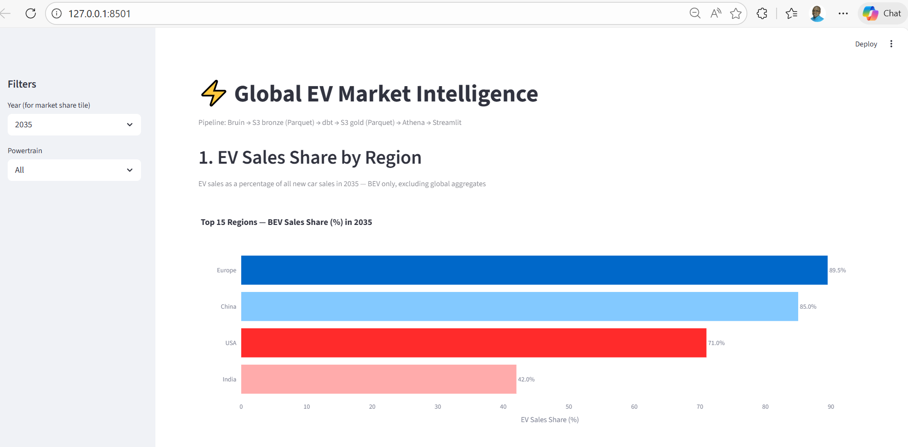 | 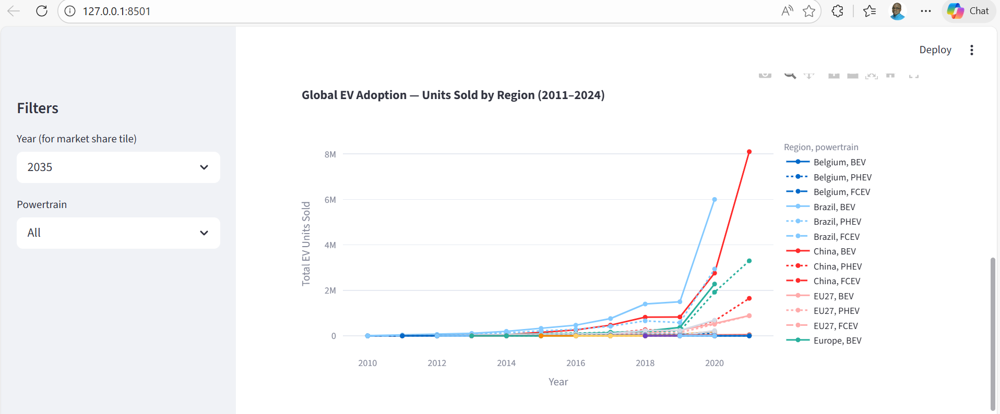 |

**Summary metrics**

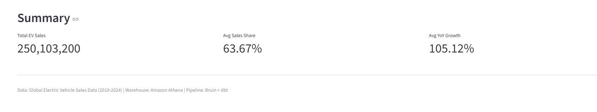

---

## Architecture

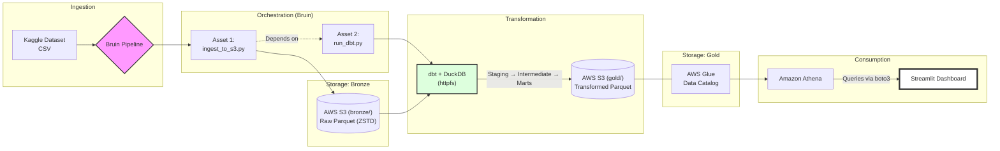

**dbt lineage graph**

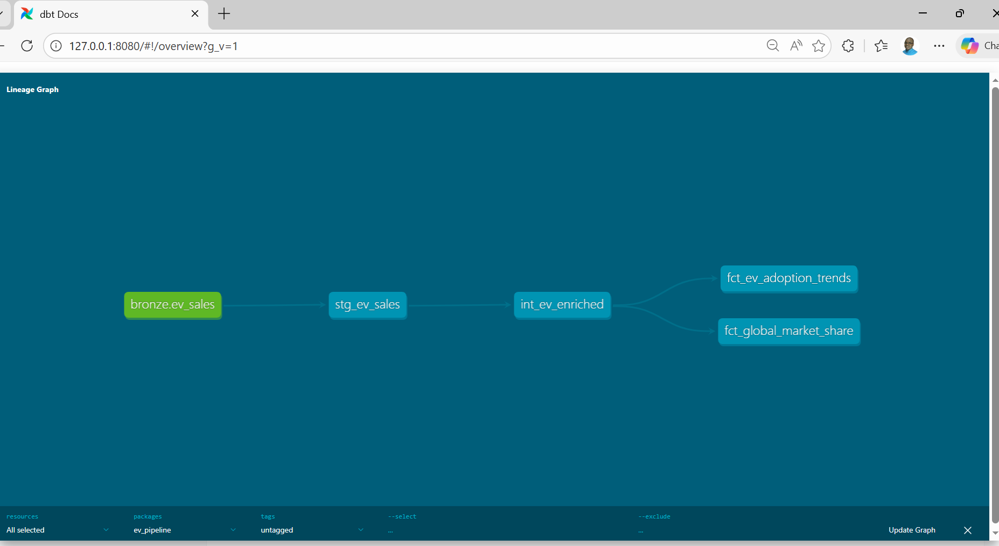

---

## Technology Stack

| Layer | Tool | Purpose |
|---|---|---|
| Infrastructure | **Terraform** | Provisions S3, Athena workgroup, Glue database |
| Orchestration | **Bruin CLI** | Runs ingestion + dbt in dependency order |
| Data lake | **AWS S3** | Stores bronze (raw) and gold (transformed) Parquet |
| Query engine | **DuckDB + httpfs** | Reads/writes S3 during transformation |
| Transformations | **dbt-core + dbt-duckdb** | Staging → intermediate → mart models |
| Schema registry | **AWS Glue Data Catalog** | Lets Athena discover S3 Parquet tables |
| Warehouse | **Amazon Athena** | Serverless SQL on S3 — ~$0.001/query for this dataset |
| Dashboard | **Streamlit + Plotly** | Interactive charts querying Athena |
| Environment | **GitHub Codespaces** | Cloud dev environment, persists in GitHub |
| Package manager | **uv** | Fast Python environment management |

**Why Athena instead of Redshift?**

| | Athena | Redshift Serverless |
|---|---|---|
| Cost model | $5 per TB scanned | $0.467/RPU-hour, 60s minimum |
| Our dataset (~50 MB Parquet) | < $0.001 per query | ~$0.008 per query minimum |
| Setup | Minutes | 15–30 minutes |

_RPU-hour - Redshift Processing Unit-hour, is the unit of measure for compute capacity in Amazon Redshift Serverless._

---

## Data Source

**[Global Electric Vehicle Sales Data (2010–2024)](https://www.kaggle.com/datasets/muhammadehsan000/global-electric-vehicle-sales-data-2010-2024)** — Kaggle

The dataset uses a **long format**: one row per metric per region/year/powertrain.

| Column | Example values |
|---|---|
| `region` | Norway, China, Europe, USA |
| `parameter` | EV sales, EV sales share, EV stock, EV stock share, EV charging points |
| `powertrain` | BEV, PHEV, FCEV, EV (aggregate) |
| `year` | 2010–2035 (historical + projections) |
| `value` | numeric — units or percent depending on parameter |

---

## Project Structure

```
ev-market-intelligence-pipeline/
├── .env                              ← secrets — never committed
├── .bruin.yml                        ← Bruin connection config
├── .gitignore
├── pyproject.toml                    ← Python dependencies (managed by uv)
├── requirements.txt
├── README.md
│
├── terraform/
│   ├── main.tf                       ← S3 bucket, Athena workgroup, Glue database
│   ├── variables.tf
│   ├── outputs.tf                    ← prints useful values after terraform apply completes
│   └── terraform.tfvars              ← bucket name + region (safe to commit)
│
├── pipelines/
│   └── ev_ingestion/
│       ├── pipeline.yml
│       └── assets/
│           ├── ingest_to_s3.py       ← CSV → Parquet → S3 bronze/
│           ├── run_dbt.py            ← calls dbt (depends on ingest)
│           └── test.sql              ← pipeline connectivity test
│
├── transform/                        ← dbt project
│   ├── dbt_project.yml
│   ├── packages.yml                  ← dbt_utils package
│   ├── profiles.yml                  ← never committed
│   └── models/
│       ├── staging/
│       │   ├── sources.yml           ← points at S3 bronze Parquet
│       │   ├── schema.yml            ← dbt tests
│       │   └── stg_ev_sales.sql
│       ├── intermediate/
│       │   └── int_ev_enriched.sql
│       └── marts/
│           ├── fct_global_market_share.sql   ← writes to S3 gold/
│           └── fct_ev_adoption_trends.sql    ← writes to S3 gold/
│
├── scripts/
│   └── register_athena_tables.py     ← registers gold Parquet in Glue
│
├── dashboard/
│   └── app.py                        ← Streamlit dashboard (queries Athena)
│
└── screenshots/                      ← evidence screenshots
```

---

## Reproducing This Project

### Prerequisites

- GitHub account
- AWS account (free tier is sufficient — estimated cost < $1)
- Kaggle account (free)

---

### Step 0 — AWS account setup

#### 0.1 Create an AWS account
1. Go to https://aws.amazon.com → **Create an AWS Account**
2. Enter email, choose account name (e.g. `ev-pipeline-project`)
3. Enter credit card — you will not be charged within free tier limits
4. Complete phone/SMS verification
5. Choose **Basic support plan** (free)
6. Sign in at https://console.aws.amazon.com

#### 0.2 Set a billing alert — do this first
1. In AWS Console, search **Billing** → click it
2. Click **Budgets** → **Create budget**
3. Choose **Use a template → Zero spend budget**
4. Enter your email → **Create budget**

You will now receive an email if AWS charges even $0.01. 

#### 0.3 Create an IAM user
Never use your root account for day-to-day work.

1. Search **IAM** → **Users** → **Create user**
2. Username: `ev-pipeline-user`
3. Select **Attach policies directly**, add:
   - `AmazonS3FullAccess`
   - `AmazonAthenaFullAccess`
   - `AWSGlueConsoleFullAccess`
   - `IAMUserChangePassword`
4. **Create user** → open the user → **Security credentials** tab
5. **Create access key** → choose **Command Line Interface (CLI)**
6. **Copy both values now** — the secret key is shown only once:
   - Access key ID: `AKIA...`
   - Secret access key: `wJalr...`

---

### Step 1 — Open the project in Codespaces

1. Fork or clone this repo to your GitHub account
2. Click the green **Code** button → **Codespaces** tab → **Create codespace on main**
3. Wait ~1 minute — VS Code opens in your browser
4. Open the terminal: `` Ctrl+` ``

---

### Step 2 — Install all tools

#### 2.1 Install uv (Python package manager)
```bash
curl -LsSf https://astral.sh/uv/install.sh | sh
source ~/.bashrc
```

#### 2.2 Create Python environment and install dependencies
```bash
# Create virtual environment
uv venv
source .venv/bin/activate

# Install all dependencies
uv pip install \
  dbt-core dbt-duckdb duckdb \
  boto3 streamlit plotly pandas \
  kaggle python-dotenv pyarrow
```

#### 2.3 Install DuckDB CLI
```bash
curl -LO https://github.com/duckdb/duckdb/releases/latest/download/duckdb_cli-linux-amd64.zip
unzip duckdb_cli-linux-amd64.zip
sudo mv duckdb /usr/local/bin/
sudo chmod +x /usr/local/bin/duckdb
duckdb --version
```

#### 2.4 Install Bruin CLI
```bash
curl -LO https://raw.githubusercontent.com/bruin-data/bruin/main/install.sh
chmod +x install.sh
./install.sh
echo 'export PATH="$HOME/.local/bin:$PATH"' >> ~/.bashrc
source ~/.bashrc
bruin --version
# Expected: Current: v0.11.504
```

#### 2.5 Install Terraform
```bash
# Remove yarn if present (causes update conflicts in Codespaces)
sudo rm -f /etc/apt/sources.list.d/yarn.list

sudo apt-get update && sudo apt-get install -y gnupg software-properties-common
wget -O- https://apt.releases.hashicorp.com/gpg | gpg --dearmor | \
  sudo tee /usr/share/keyrings/hashicorp-archive-keyring.gpg > /dev/null
echo "deb [signed-by=/usr/share/keyrings/hashicorp-archive-keyring.gpg] \
  https://apt.releases.hashicorp.com $(lsb_release -cs) main" | \
  sudo tee /etc/apt/sources.list.d/hashicorp.list
sudo apt update && sudo apt-get install terraform
terraform -version
```

#### 2.6 Install AWS CLI
```bash
curl "https://awscli.amazonaws.com/awscli-exe-linux-x86_64.zip" -o "awscliv2.zip"
unzip awscliv2.zip
sudo ./aws/install
aws --version
```

#### 2.7 Store your secrets
Create a `.env` file — **never commit this to Git**:

```bash
cat > .env << 'EOF'
# AWS credentials (from Step 0.3)
AWS_ACCESS_KEY_ID=PASTE_YOUR_ACCESS_KEY_HERE
AWS_SECRET_ACCESS_KEY=PASTE_YOUR_SECRET_KEY_HERE
AWS_DEFAULT_REGION=us-east-1

# Kaggle credentials (from kaggle.com → Account → API → Create Token)
KAGGLE_USERNAME=your_kaggle_username
KAGGLE_KEY=your_kaggle_api_key

# S3 bucket name — must be globally unique across all AWS accounts
S3_BUCKET_NAME=ev-pipeline-yourname-2024
EOF
```

Add to `.gitignore`:
```bash
grep -q "^\.env$" .gitignore || echo ".env" >> .gitignore
grep -q "^data/$" .gitignore || echo "data/" >> .gitignore
grep -q "^\.terraform$" .gitignore || echo ".terraform" >> .gitignore
grep -q "^terraform.tfstate" .gitignore || echo "terraform.tfstate*" >> .gitignore
echo "transform/profiles.yml" >> .gitignore
echo "*.duckdb" >> .gitignore
```

Configure AWS CLI:
```bash
source .env
aws configure set aws_access_key_id $AWS_ACCESS_KEY_ID
aws configure set aws_secret_access_key $AWS_SECRET_ACCESS_KEY
aws configure set default.region us-east-1
aws configure set default.output json

# Verify — should return your account ID
aws sts get-caller-identity
```

---

### Step 3 — Provision AWS infrastructure with Terraform

Terraform creates your S3 bucket, Athena workgroup, and Glue database in one command.

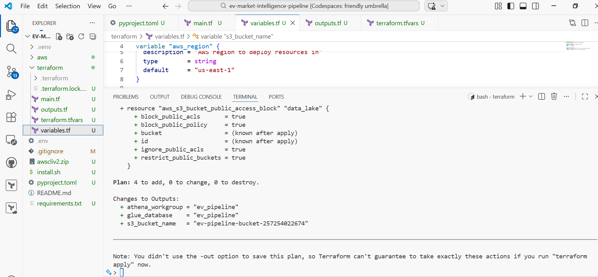

#### 3.1 Create Terraform files

**`terraform/main.tf`**
```hcl
terraform {
  required_providers {
    aws = {
      source  = "hashicorp/aws"
      version = "~> 5.0"
    }
  }
}

provider "aws" {
  region = var.aws_region
}

resource "aws_s3_bucket" "data_lake" {
  bucket = var.s3_bucket_name
  tags = {
    Project   = "ev-pipeline"
    ManagedBy = "terraform"
  }
}

resource "aws_s3_bucket_public_access_block" "data_lake" {
  bucket                  = aws_s3_bucket.data_lake.id
  block_public_acls       = true
  block_public_policy     = true
  ignore_public_acls      = true
  restrict_public_buckets = true
}

resource "aws_glue_catalog_database" "ev_pipeline" {
  name        = "ev_pipeline"
  description = "EV market intelligence pipeline — dbt gold layer tables"
}

resource "aws_athena_workgroup" "ev_pipeline" {
  name = "ev_pipeline"
  configuration {
    result_configuration {
      output_location = "s3://${var.s3_bucket_name}/athena-results/"
    }
  }
  tags = { Project = "ev-pipeline" }
}
```

**`terraform/variables.tf`**
```hcl
variable "aws_region" {
  description = "AWS region to deploy resources in"
  type        = string
  default     = "us-east-1"
}

variable "s3_bucket_name" {
  description = "S3 bucket name — must be globally unique"
  type        = string
}
```

**`terraform/outputs.tf`**
```hcl
output "s3_bucket_name" {
  value = aws_s3_bucket.data_lake.bucket
}
output "athena_workgroup" {
  value = aws_athena_workgroup.ev_pipeline.name
}
output "glue_database" {
  value = aws_glue_catalog_database.ev_pipeline.name
}
```

**`terraform/terraform.tfvars`**
```hcl
aws_region     = "us-east-1"
s3_bucket_name = "ev-pipeline-yourname-2024"   # change to match your .env
```

#### 3.2 Run Terraform
```bash
cd terraform
terraform init       # download AWS provider plugin (once only)
terraform plan       # preview what will be created
terraform apply      # create resources (type 'yes' when prompted)
cd ..
```

Expected output: `Apply complete! Resources: 4 added, 0 changed, 0 destroyed.`

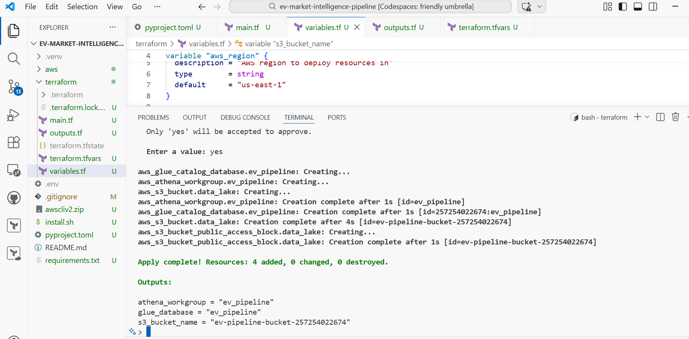

Verify the S3 bucket was created:
```bash
aws s3 ls | grep ev-pipeline
```

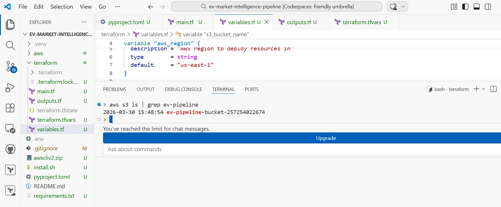

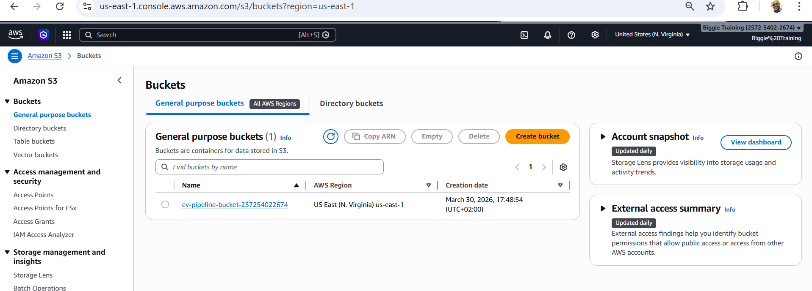

---

### Step 4 — Configure Bruin pipeline

#### 4.1 Initialise Bruin
```bash
bruin init default
```

Replace `.bruin.yml`:
```yaml
default_environment: default

environments:
  default:
    connections:
      duckdb:
        - name: "duckdb-default"
          path: "ev_pipeline.duckdb"
```

#### 4.2 Create pipeline config

```bash
mkdir -p pipelines/ev_ingestion/assets
```

**`pipelines/ev_ingestion/pipeline.yml`**
```yaml
name: ev_ingestion_pipeline
schedule: "@daily"
start_date: "2024-01-01"
default_connections:
  duckdb: "duckdb-default"
```

#### 4.3 Asset 1 — Ingest CSV and write Parquet to S3 bronze layer

**`pipelines/ev_ingestion/assets/ingest_to_s3.py`**
```python
""" @bruin
name: bronze.ev_sales_parquet
type: python
connection: duckdb-default
description: "Downloads EV sales CSV from Kaggle, converts to Parquet, uploads to S3 bronze layer."
@bruin """

import os
import subprocess
import duckdb
import boto3
from pathlib import Path
from dotenv import load_dotenv

load_dotenv()

BUCKET        = os.getenv("S3_BUCKET_NAME")
REGION        = os.getenv("AWS_DEFAULT_REGION", "us-east-1")
BRONZE_PREFIX = "bronze/ev_sales"
LOCAL_DIR     = Path("data/raw")
LOCAL_DIR.mkdir(parents=True, exist_ok=True)

# Step 1: Download from Kaggle
os.environ["KAGGLE_USERNAME"] = os.getenv("KAGGLE_USERNAME", "")
os.environ["KAGGLE_KEY"]      = os.getenv("KAGGLE_KEY", "")

DATASET = "muhammadehsan000/global-electric-vehicle-sales-data-2010-2024"
print(f"Downloading {DATASET} ...")
subprocess.run(
    ["kaggle", "datasets", "download", "-d", DATASET, "-p", str(LOCAL_DIR), "--unzip"],
    check=True
)

# Step 2: Convert CSV → Parquet (ZSTD compression ~5x smaller than CSV)
csv_files = list(LOCAL_DIR.glob("*.csv"))
if not csv_files:
    raise FileNotFoundError("No CSV files found after download")

parquet_path = LOCAL_DIR / "ev_sales.parquet"
con = duckdb.connect()
con.execute(f"""
    COPY (
        SELECT * FROM read_csv_auto('{LOCAL_DIR}/*.csv', union_by_name=true)
    )
    TO '{parquet_path}'
    (FORMAT PARQUET, COMPRESSION ZSTD)
""")
print(f"Parquet written: {parquet_path} ({parquet_path.stat().st_size/1024/1024:.2f} MB)")
con.close()

# Step 3: Upload to S3 bronze layer
s3    = boto3.client("s3", region_name=REGION)
s3_key = f"{BRONZE_PREFIX}/ev_sales.parquet"
print(f"Uploading to s3://{BUCKET}/{s3_key} ...")
s3.upload_file(str(parquet_path), BUCKET, s3_key)
print("Upload complete ✓")

# Step 4: Verify
response = s3.head_object(Bucket=BUCKET, Key=s3_key)
print(f"Verified on S3: {response['ContentLength']/1024/1024:.2f} MB")
```

#### 4.4 Asset 2 — Run dbt transformations

**`pipelines/ev_ingestion/assets/run_dbt.py`**
```python
""" @bruin
name: gold.dbt_models
type: python
connection: duckdb-default
description: "Runs dbt transformation models after ingestion."
depends:
  - bronze.ev_sales_parquet
@bruin """

import subprocess
import sys

print("Running dbt models...")
result = subprocess.run(
    ["dbt", "run", "--project-dir", "transform", "--profiles-dir", "transform"],
    capture_output=True, text=True
)
print(result.stdout)
if result.returncode != 0:
    print(result.stderr)
    sys.exit(1)
print("dbt complete ✓")
```

---

### Step 5 — Set up dbt transformations

#### 5.1 Initialise dbt project
```bash
uv run dbt init transform --skip-profile-setup
cd transform
rm -rf models/example
mkdir -p models/staging models/intermediate models/marts
cd ..
```

#### 5.2 Configure dbt profile

Create **`transform/profiles.yml`** (not committed — contains credentials):
```yaml
ev_pipeline:
  target: dev
  outputs:
    dev:
      type: duckdb
      path: "/workspaces/ev-market-intelligence-pipeline/ev_pipeline.duckdb"
      schema: main
      extensions:
        - httpfs
        - parquet
      settings:
        s3_region: "us-east-1"
        s3_access_key_id: "{{ env_var('AWS_ACCESS_KEY_ID') }}"
        s3_secret_access_key: "{{ env_var('AWS_SECRET_ACCESS_KEY') }}"
      external_root: "s3://{{ env_var('S3_BUCKET_NAME') }}/gold"
```

> **Note:** The `path` must be an absolute path. Run `pwd` from the project root to get yours and update accordingly.

#### 5.3 Configure dbt_project.yml

Replace **`transform/dbt_project.yml`**:
```yaml
name: 'ev_pipeline'
version: '1.0.0'
profile: 'ev_pipeline'

model-paths: ["models"]
seed-paths: ["seeds"]
test-paths: ["tests"]
analysis-paths: ["analyses"]
macro-paths: ["macros"]
clean-targets: ["target", "dbt_packages"]

models:
  ev_pipeline:
    staging:
      +materialized: view       # Views cost nothing — no data stored
    intermediate:
      +materialized: table      # Local DuckDB table for intermediate work
    marts:
      +materialized: external   # Writes Parquet directly to S3 gold/
      +format: parquet
      +compression: zstd
```

#### 5.4 Source definition — points at S3 bronze Parquet

**`transform/models/staging/sources.yml`**
```yaml
version: 2

sources:
  - name: bronze
    description: "Raw EV sales Parquet files in S3 bronze layer"
    meta:
      external_location: "s3://{{ env_var('S3_BUCKET_NAME') }}/bronze/ev_sales/{name}.parquet"
    tables:
      - name: ev_sales
        description: "Raw global EV sales data, 2010–2024"
```

#### 5.5 Staging model

**`transform/models/staging/stg_ev_sales.sql`**
```sql
-- Reads raw Parquet from S3 bronze layer, cleans column values.
-- Materialised as a VIEW — no data stored, just a query definition.
-- Dataset is long format: one row per metric (parameter) per region/year/powertrain.

with source as (
    select * from {{ source('bronze', 'ev_sales') }}
),

cleaned as (
    select
        trim(region)                          as region,
        trim(category)                        as category,
        trim(parameter)                       as parameter,  -- e.g. 'EV sales', 'EV stock share'
        trim(mode)                            as mode,       -- e.g. 'Cars', 'Buses'
        trim(powertrain)                      as powertrain, -- e.g. 'BEV', 'PHEV', 'EV'
        cast(year as integer)                 as year,
        trim(unit)                            as unit,       -- e.g. 'Vehicles', 'percent'
        coalesce(cast(value as double), 0)    as value

    from source
    where year is not null
      and region is not null
      and parameter is not null
)

select * from cleaned
```

#### 5.6 Intermediate model

**`transform/models/intermediate/int_ev_enriched.sql`**
```sql
-- Pivots long-format data into one row per region/year/powertrain.
-- Handles two granularity levels in the dataset:
--   EV sales/stock → by powertrain (BEV, PHEV, FCEV)
--   EV sales share/stock share → aggregate EV level only

with source as (
    select * from {{ ref('stg_ev_sales') }}
),

cars_only as (
    select * from source where mode = 'Cars'
),

-- Part 1: sales and stock broken down by powertrain
sales_by_powertrain as (
    select
        region, year, powertrain,
        sum(case when parameter = 'EV sales'         then value else 0 end) as ev_sales_units,
        sum(case when parameter = 'EV stock'         then value else 0 end) as ev_stock_units,
        sum(case when parameter = 'EV charging points' then value else 0 end) as charging_points
    from cars_only
    where powertrain in ('BEV', 'PHEV', 'FCEV')
    group by region, year, powertrain
),

-- Part 2: share metrics exist only at aggregate EV level
share_metrics as (
    select
        region, year,
        avg(case when parameter = 'EV sales share' then value else null end) as ev_sales_share_pct,
        avg(case when parameter = 'EV stock share' then value else null end) as ev_stock_share_pct
    from cars_only
    where powertrain = 'EV'
    group by region, year
),

-- Join share metrics onto each powertrain row
joined as (
    select
        s.region, s.year, s.powertrain,
        s.ev_sales_units, s.ev_stock_units, s.charging_points,
        m.ev_sales_share_pct, m.ev_stock_share_pct
    from sales_by_powertrain s
    left join share_metrics m on s.region = m.region and s.year = m.year
),

with_yoy as (
    select *,
        lag(ev_sales_units) over (
            partition by region, powertrain order by year
        ) as prior_year_sales
    from joined
),
final as (
    select
        region,
        year,
        powertrain,
        ev_sales_units,
        ev_stock_units,
        charging_points,
        ev_sales_share_pct,
        ev_stock_share_pct,
        case
            when prior_year_sales > 0
            then round(
                (ev_sales_units - prior_year_sales) / prior_year_sales * 100, 2
            )
            else null
        end as yoy_growth_pct
    from with_yoy
)

select * from final

```

#### 5.7 Mart models — written as Parquet to S3 gold layer

**`transform/models/marts/fct_global_market_share.sql`**
```sql
-- EV sales share (%) by region for a given year.
-- Powers Dashboard Tile 1 (categorical bar chart).
-- Written to s3://bucket/gold/fct_global_market_share/data.parquet

{{ config(
    materialized='external',
    location="s3://" ~ env_var('S3_BUCKET_NAME') ~ "/gold/fct_global_market_share/data.parquet",
    format='parquet'
) }}

with enriched as (
    select * from {{ ref('int_ev_enriched') }}
)

select
    year, region, powertrain,
    avg(ev_sales_share_pct)    as avg_sales_share_pct,
    sum(ev_sales_units)        as total_ev_sales,
    avg(ev_stock_share_pct)    as avg_stock_share_pct,
    sum(charging_points)       as total_charging_points,
    row_number() over (partition by year order by avg(ev_sales_share_pct) desc) as region_rank
from enriched
where ev_sales_units > 0
group by year, region, powertrain
order by year, avg_sales_share_pct desc
```

**`transform/models/marts/fct_ev_adoption_trends.sql`**
```sql
-- EV sales trends over time by region.
-- Powers Dashboard Tile 2 (temporal line chart).
-- Written to s3://bucket/gold/fct_ev_adoption_trends/data.parquet

{{ config(
    materialized='external',
    location="s3://" ~ env_var('S3_BUCKET_NAME') ~ "/gold/fct_ev_adoption_trends/data.parquet",
    format='parquet'
) }}

with enriched as (
    select * from {{ ref('int_ev_enriched') }}
)

select
    year, region, powertrain,
    sum(ev_sales_units)        as total_ev_sales,
    avg(ev_sales_share_pct)    as avg_sales_share_pct,
    avg(yoy_growth_pct)        as avg_yoy_growth_pct
from enriched
where ev_sales_units > 0
group by year, region, powertrain
order by year, region
```

#### 5.8 Register Glue tables so Athena can query the gold Parquet

**`scripts/register_athena_tables.py`**
```python
# Registers dbt gold Parquet files in AWS Glue Data Catalog.
# Athena uses Glue as a schema registry — without this, Athena cannot find the tables.
# Re-run whenever the mart schema changes.

import boto3, os
from dotenv import load_dotenv

load_dotenv()

BUCKET   = os.getenv("S3_BUCKET_NAME")
REGION   = os.getenv("AWS_DEFAULT_REGION", "us-east-1")
GLUE_DB  = "ev_pipeline"

glue = boto3.client("glue", region_name=REGION)

TABLES = [
    {
        "name": "fct_global_market_share",
        "s3_path": f"s3://{BUCKET}/gold/fct_global_market_share/",
        "columns": [
            {"Name": "year",                  "Type": "int"},
            {"Name": "region",                "Type": "string"},
            {"Name": "powertrain",            "Type": "string"},
            {"Name": "avg_sales_share_pct",   "Type": "double"},
            {"Name": "total_ev_sales",        "Type": "double"},
            {"Name": "avg_stock_share_pct",   "Type": "double"},
            {"Name": "total_charging_points", "Type": "double"},
            {"Name": "region_rank",           "Type": "bigint"},
        ]
    },
    {
        "name": "fct_ev_adoption_trends",
        "s3_path": f"s3://{BUCKET}/gold/fct_ev_adoption_trends/",
        "columns": [
            {"Name": "year",                "Type": "int"},
            {"Name": "region",              "Type": "string"},
            {"Name": "powertrain",          "Type": "string"},
            {"Name": "total_ev_sales",      "Type": "double"},
            {"Name": "avg_sales_share_pct", "Type": "double"},
            {"Name": "avg_yoy_growth_pct",  "Type": "double"},
        ]
    },
]

for table in TABLES:
    try:
        glue.delete_table(DatabaseName=GLUE_DB, Name=table["name"])
        print(f"Deleted existing: {table['name']}")
    except glue.exceptions.EntityNotFoundException:
        pass

    glue.create_table(
        DatabaseName=GLUE_DB,
        TableInput={
            "Name": table["name"],
            "StorageDescriptor": {
                "Columns": table["columns"],
                "Location": table["s3_path"],
                "InputFormat": "org.apache.hadoop.mapred.TextInputFormat",
                "OutputFormat": "org.apache.hadoop.hive.ql.io.HiveIgnoreKeyTextOutputFormat",
                "SerdeInfo": {
                    "SerializationLibrary": "org.apache.hadoop.hive.ql.io.parquet.serde.ParquetHiveSerDe"
                },
            },
            "TableType": "EXTERNAL_TABLE",
            "Parameters": {"classification": "parquet"}
        }
    )
    print(f"Registered: {GLUE_DB}.{table['name']} → {table['s3_path']}")

print("Done. Tables are now queryable in Athena.")
```

---

### Step 6 — Run the full pipeline

```bash
# Activate environment and load secrets (do this every new terminal)
source .venv/bin/activate
source .env
export $(cat .env | grep -v '^#' | xargs)

# Run end-to-end: Bruin handles ingestion then calls dbt automatically
bruin run pipelines/ev_ingestion/

# Register gold tables in Glue (needed once, or after schema changes)
python scripts/register_athena_tables.py
```

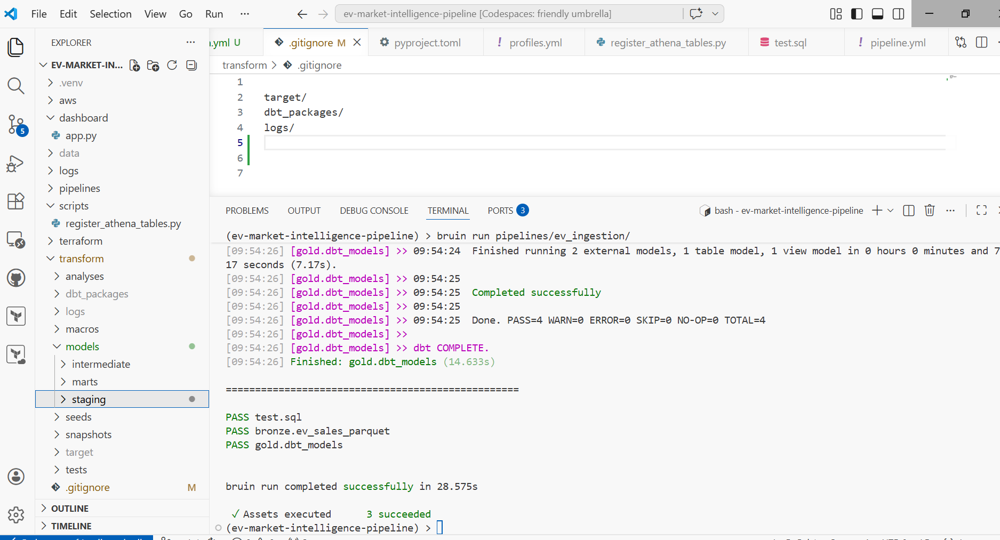

Verify data landed in S3 using aws cli or aws console:
```bash
# Bronze layer
aws s3 ls s3://$S3_BUCKET_NAME/bronze/ev_sales/

# Gold layer (dbt mart tables)
aws s3 ls s3://$S3_BUCKET_NAME/gold/ --recursive
```

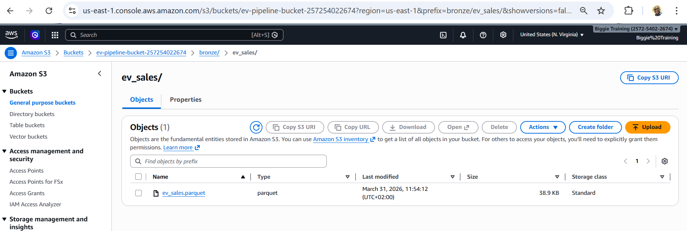

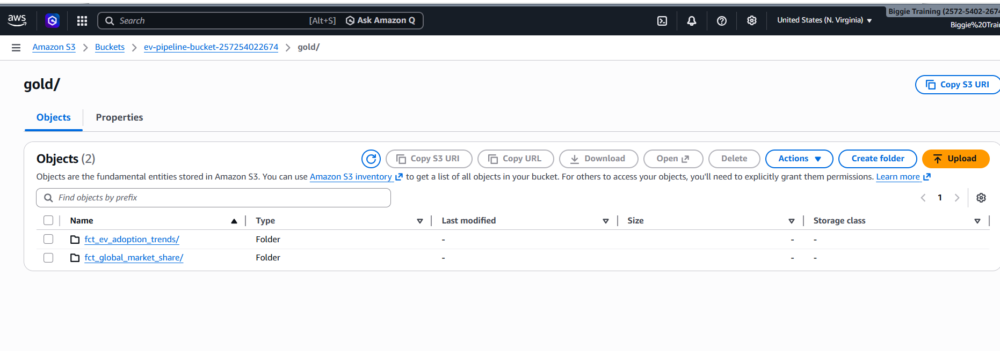

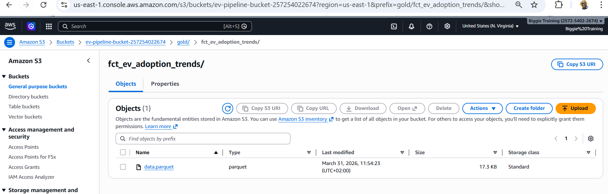

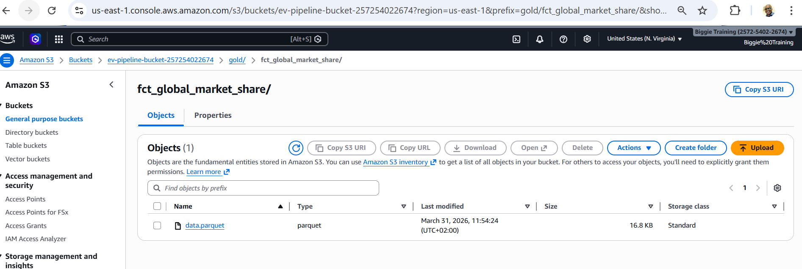

Verify dbt models ran correctly:
```bash
uv run dbt run --project-dir transform --profiles-dir transform
```

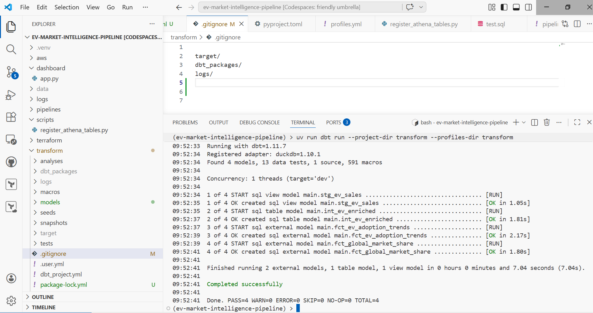

---

### Step 7 — Query Athena

```bash
# Test Athena can query the gold tables
aws athena start-query-execution \
  --query-string "SELECT COUNT(*) FROM ev_pipeline.fct_global_market_share" \
  --work-group ev_pipeline \
  --query-execution-context Database=ev_pipeline \
  --output text
```

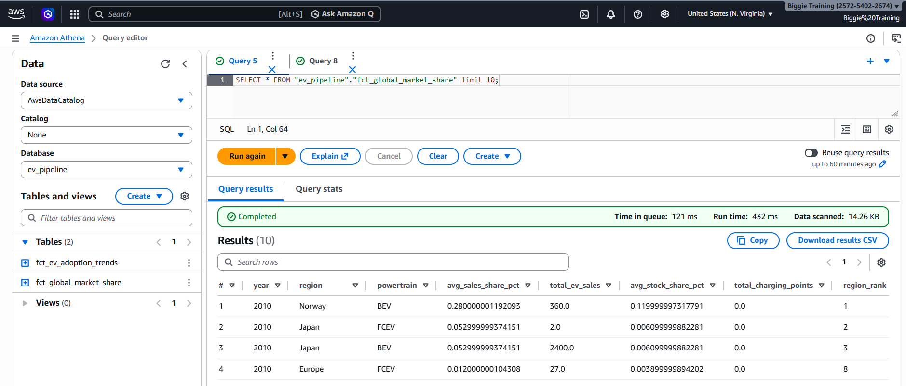

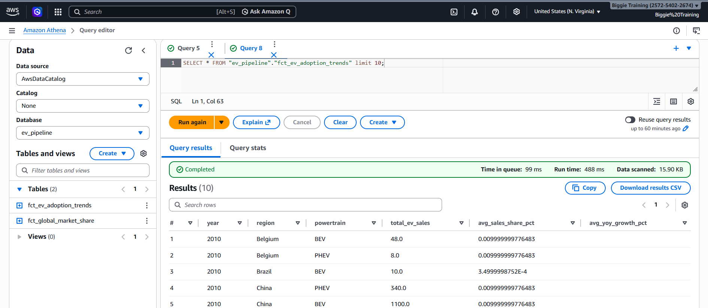

---

### Step 8 — Run the dashboard

```bash
streamlit run dashboard/app.py
# Codespaces: click the forwarded port popup to open in browser
```


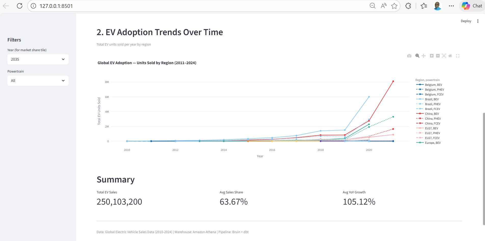

---

### Step 9 — dbt tests

The pipeline includes 13 data quality tests across 4 models, demonstrating 4 different test types.

#### Install dbt packages
**`transform/packages.yml`**
```yaml
packages:
  - package: dbt-labs/dbt_utils
    version: [">=1.0.0", "<2.0.0"]
```

```bash
uv run dbt deps --project-dir transform --profiles-dir transform
```

#### Test schema — `transform/models/staging/schema.yml`
```yaml
version: 2

models:
  - name: stg_ev_sales
    description: "Cleaned EV sales source data"
    columns:
      - name: region
        tests:
          - not_null                     # Test type 1: not_null
      - name: year
        tests:
          - not_null

      - name: value
        tests:
          - not_null

  - name: int_ev_enriched
    description: "Pivoted and enriched EV data"
    columns:
      - name: powertrain
        tests:
          - not_null
          - accepted_values:
              values: ['BEV', 'PHEV', 'FCEV']
      - name: ev_sales_units
        tests:
          - dbt_utils.expression_is_true: # Test type 3: custom expression
              expression: ">= 0"

  - name: fct_global_market_share
    description: "Global market share mart"
    columns:
      - name: region
        tests:
          - not_null
      - name: avg_sales_share_pct
        tests:
          - dbt_utils.expression_is_true:
              expression: "between 0 and 100"
      - name: year
        tests:
          - dbt_utils.expression_is_true:
              expression: "between 2010 and 2040"

  - name: fct_ev_adoption_trends
    description: "EV adoption trends mart"
    columns:
      - name: region
        tests:
          - not_null
      - name: total_ev_sales
        tests:
          - not_null
          - dbt_utils.expression_is_true:
              expression: ">= 0"
      - name: powertrain
        tests:
          - relationships:               # Test type 4: referential integrity
              to: ref('int_ev_enriched')
              field: powertrain
```

Run the tests:
```bash
uv run dbt test --project-dir transform --profiles-dir transform
```

Expected: `Done. PASS=13 WARN=0 ERROR=0 SKIP=0 NO-OP=0 TOTAL=13`

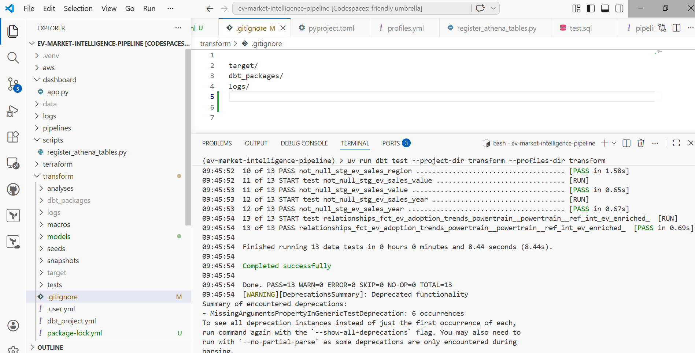

**Test types demonstrated:**

| Test | What it checks | Applied to |
|---|---|---|
| `not_null` | Column has no null values | `region`, `year`, `value`, `ev_sales_units` |
| `accepted_values` | Column only contains expected values | `powertrain` |
| `expression_is_true` | Custom SQL condition holds for every row | `ev_sales_units >= 0`, share between 0–100 |
| `relationships` | Values in one model exist in another | `powertrain` in trends exists in enriched |

---

### Step 10 — Generate dbt lineage docs

```bash
uv run dbt docs generate --project-dir transform --profiles-dir transform
uv run dbt docs serve --project-dir transform --profiles-dir transform
# Opens at http://127.0.0.1:8080
```


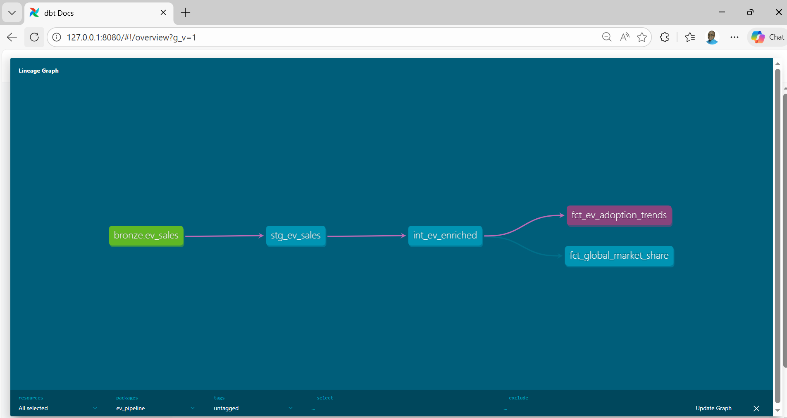

---

### Step 11 — Save to GitHub

```bash
git add .
git commit -m "Complete EV pipeline — Terraform, Bruin, S3, Athena, dbt, Streamlit"
git push origin main
```

---

## Daily Workflow Cheatsheet

```bash
# 1. Activate environment (every new terminal)
source .venv/bin/activate
source .env
export $(cat .env | grep -v '^#' | xargs)

# 2. Run the full pipeline (ingestion → dbt → S3)
bruin run pipelines/ev_ingestion/

# 3. dbt only (if you edited SQL models, no re-ingestion needed)
uv run dbt run --project-dir transform --profiles-dir transform

# 4. Re-register Athena tables (after schema changes)
python scripts/register_athena_tables.py

# 5. Launch dashboard
streamlit run dashboard/app.py

# 6. Run data quality tests
uv run dbt test --project-dir transform --profiles-dir transform

# 7. Save work
git add . && git commit -m "your message" && git push
```

---

## Cost Control

When you are not actively developing, destroy AWS resources to eliminate all charges:

```bash
# WARNING: deletes your S3 data. Back up first if needed.
cd terraform && terraform destroy && cd ..
```

To rebuild from scratch:
```bash
cd terraform && terraform apply && cd ..
bruin run pipelines/ev_ingestion/
python scripts/register_athena_tables.py
```

**Estimated running cost while active:**

| Resource | Monthly cost |
|---|---|
| S3 storage (~50 MB) | ~$0.00 (within free tier) |
| Athena queries (~50 MB Parquet) | ~$0.00 (<$0.001 per query) |
| Glue Data Catalog (2 tables) | $0.00 (always free) |
| **Total** | **~$0.00** |

---

## Key Design Decisions

**Why Parquet on S3?** Athena charges per TB scanned. Parquet with ZSTD compression is ~10–20x smaller than CSV, reducing query cost by the same factor.

**Why DuckDB as the transformation engine?** DuckDB's `httpfs` extension reads and writes S3 directly without staging data locally. Combined with `dbt-duckdb`, it gives dbt full S3 read/write capability at near-zero infrastructure cost.

**Why the intermediate model stays local?** `int_ev_enriched` is a DuckDB table used only during the dbt run. Writing it to S3 would add storage cost and Glue registration for a table nothing outside dbt ever queries.

**Why the long-format pivot matters?** The dataset mixes two granularities: `EV sales` is broken down by powertrain (BEV/PHEV/FCEV) while `EV sales share` exists only at the aggregate `EV` level. The intermediate model handles this by pivoting each granularity separately, then joining them.

---

## DataTalks.Club Evaluation Criteria

| Criterion | Implementation |
|---|---|
| Problem description | Global EV market share and adoption trend analysis — described above |
| Cloud | AWS (S3, Athena, Glue) — provisioned with Terraform IaC  |
| Batch pipeline | Bruin orchestrates daily ingestion + dbt transformation  |
| Data warehouse | Amazon Athena — Parquet tables partitioned via S3 prefix  |
| Transformations | dbt staging → intermediate → marts with lineage graph  |
| Dashboard | Streamlit — 2 tiles (categorical bar + temporal line chart)  |
| Reproducibility | This README — step-by-step from zero to running dashboard  |

---

## What is a Powertrain in Electric Vehicles?

In the context of electric vehicles, **powertrain** refers to the system
that generates power and delivers it to the wheels. It tells you *how* the vehicle is powered.

The dataset uses three powertrain types:

| Powertrain | Full name | How it works |
|---|---|---|
| **BEV** | Battery Electric Vehicle | Runs entirely on a battery — no petrol engine at all. Charged from the grid. Examples: Tesla Model 3, Nissan Leaf |
| **PHEV** | Plug-in Hybrid Electric Vehicle | Has both a battery *and* a petrol engine. Can be charged from the grid for short electric-only trips, then switches to petrol for longer range. Examples: Toyota Prius Prime, Mitsubishi Outlander PHEV |
| **FCEV** | Fuel Cell Electric Vehicle | Uses hydrogen to generate electricity onboard — no battery charging needed. Refuelled with hydrogen gas like a petrol car. Very rare currently. Examples: Toyota Mirai, Hyundai Nexo |
| **EV** | Electric Vehicle (aggregate) | Used in the dataset as an umbrella term covering BEV + PHEV + FCEV combined — appears only in share metrics like `EV sales share` |

**References:**
- Solaris eMobility — [EV, BEV, HEV, PHEV, FCEV explained](https://ecity.solarisbus.com/en/knowledge-base/ev-bev-hev-phev-fce)
- Toyota of Orlando — [BEV, HEV, PHEV and FCEV: What's the difference?](https://www.toyotaoforlando.com/research/bev-hev-phev-and-fcev-whats-the-difference.html)


> **Why it matters for this dashboard:**
> BEV is the dominant and fastest-growing category — it is the one most analysts
> focus on when measuring the "true" EV transition. That is why the market share
> bar chart filters to `powertrain = 'BEV'` — it gives the cleanest signal of
> which regions are genuinely moving away from petrol.

---
## Author

**Bigboy Mutichakwa**
Data Engineer | DataTalks.Club DE Zoomcamp 2026

- LinkedIn: [linkedin.com/in/bigboy-m-57211074](https://www.linkedin.com/in/bigboy-m-57211074/)
- Email: bmuticha@gmail.com
- GitHub: [github.com/biggymuticha](https://github.com/biggymuticha)

---

## Acknowledgements

- [DataTalks.Club Data Engineering Zoomcamp](https://github.com/DataTalksClub/data-engineering-zoomcamp)
- [Global Electric Vehicle Sales Data (2010-2024)](https://www.kaggle.com/datasets/muhammadehsan000/global-electric-vehicle-sales-data-2010-2024) — data source
- [Bruin](https://getbruin.com) — pipeline orchestration
- [dbt-duckdb](https://github.com/duckdb/dbt-duckdb) — DuckDB adapter for dbt
